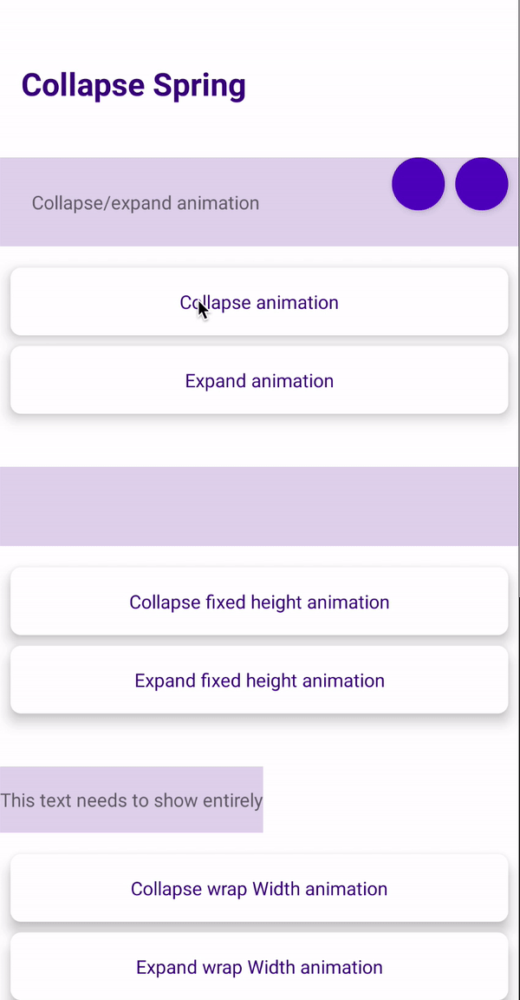

# jerry
[](https://jitpack.io/#alexandregpereira/jerry)

Android library animation APIs that uses the [SpringAnimation](https://developer.android.com/guide/topics/graphics/spring-animation) behind. Jerry APIs helps to build complex physics based animations. This library also provides some animations ready to use that change the view visibility.

## Why jerry?
Using a physics based animation makes the changes in target value more smooth and natural. When we use the default animation system provided by Android, these kind of changes in the traget value abrupted stops the continuation of the animation. The examples below ilustrate this behavior.

**Figure 1.** Animation built with jerry physics-based APIs | **Figure 2.** Animation built with ViewProperty animation
-|-
 | 

**Figure 1 code**
```
moveView.translationXSpring(targetValue = pointX)
    .translationYSpring(targetValue = pointY)
    .force(stiffness = 60f, dampingRatio = 0.8f)
    .start()
```
**Figure 2 code**
```
moveView.animate()
    .translationX(pointX)
    .translationY(pointY)
    .setInterpolator(AccelerateDecelerateInterpolator())
    .setDuration(500)
    .start()
```

## Setup
**Step 1.** Add the JitPack repository in your root build.gradle at the end of repositories:
```
allprojects {
    repositories {
        ...
        maven { url 'https://jitpack.io' }
    }
}
```
**Step 2.** Add the dependency
```
dependencies {
    implementation 'com.github.alexandregpereira:jerry:version'
}
```

## Animating view properties examples
Like the view property animation system provided by the `android.animation` package, you can use a set of APIs to change the view properties using jerry physic-based animation APIs.

Example 1 | Example 2 | Example 3
-|-|-
 |  | 


Example 4 | Example 5 | Example 6
-|-|-
 |  |  

### Example 1

<p align="center">
  
</p>

```
view.scaleXSpring(targetValue = 0.3f)
    .scaleYSpring(targetValue = 0.3f)
    .start()
```

### Example 2

<p align="center">
  
</p>

```
view.apply {
    scaleXSpring(targetValue = 0.6f)
        .scaleYSpring(targetValue = 0.6f)
        .after(
            scaleXSpring(targetValue = 1f)
                .scaleYSpring(
                    targetValue = 1f,
                )
                .force(dampingRatio = 0.15f)
        )
        .start()
}
```

### Example 3

<p align="center">
  
</p>

```
view.rotationSpring(targetValue = 180f)
    .start()
```

### Example 4

<p align="center">
  
</p>

```
view.apply {
    scaleXSpring(targetValue = 0.3f)
        .scaleYSpring(targetValue = 0.3f)
        .force(stiffness = 200f, dampingRatio = 0.7f)
        .translationXSpring(targetValue = screenSize - width.toFloat() * 0.7f)
        .lastForce(stiffness = 30f)
        .start()
}
```

### Example 5

<p align="center">
  
</p>

```
view.apply {
    translationXSpring(targetValue = screenSize - width.toFloat())
        .force(stiffness = 200f)
        .after(
            translationXSpring(targetValue = 0f)
                .force(dampingRatio = 0.5f)
        )
        .start()
}
```

### Example 6

<p align="center">
   
</p>

```
view.apply {
    pivotX = width.toFloat()
    translationXSpring(targetValue = screenSize - width.toFloat())
        .force(stiffness = 1000f)
        .scaleXSpring(targetValue = 0.6f)
        .lastForce(stiffness = 50f)
        .after(
            scaleXSpring(targetValue = 1f)
                .after(
                    translationXSpring(targetValue = screenSize * 0.2f)
                        .force(dampingRatio = 0.3f)
                )
        )
        .start()
}
```

## Changing view visibility using animation examples
This library also provides some animations ready to use that change the view visibility.

### Expandable animation
<p align="center">
    
</p>

```
// Expandable height
view.goneCollapseHeight()
// or
view.visibleOrGoneExpandableHeight(visible = false)

view.visibleExpandHeight()
// or
view.visibleOrGoneExpandableHeight(visible = true)

// Expandable width
view.goneCollapseWidth()
// or
view.visibleOrGoneExpandableWidth(visible = false)

view.visibleExpandWidth()
// or
view.visibleOrGoneExpandableWidth(visible = true)
```

### Fade animation
<p align="center">
    
</p>

```
// Fade text change
textView.setTextFadeSpring(text = "some text")

// Fade out
view.goneFadeOut()
// or
view.visibleOrGoneFade(visible = false)

// Fade in
view.visibleFadeIn()
// or
view.visibleOrGoneFade(visible = true)
```

### Expandable Fading
<p align="center">
    
</p>

```
// Expandable height
view.goneCollapseHeightFadeOut()
// or
view.visibleOrGoneExpandableHeightFade(visible = false)

view.visibleExpandHeightFadeIn()
// or
view.visibleOrGoneExpandableHeightFade(visible = true)

// Expandable width
view.goneCollapseWidthFadeOut()
// or
view.visibleOrGoneExpandableWidthFade(visible = false)

view.visibleExpandWidthFadeIn()
// or
view.visibleOrGoneExpandableWidthFade(visible = true)
```

## RecyclerView ItemAnimator
The class `BaseItemAnimator` provides the base of a custom `ItemAnimator` implementation. Overrides the methods `preAnimateAdd`, `startRemoveAnimation`, `startAddAnimation`, `startOldHolderChangeAnimation`, `startNewHolderChangeAnimation` or `startMoveAnimation` when you want to change any default animation. You can follow the `ElevationSpringItemAnimator` class in this repository as example.

### ElevationSpringItemAnimator
The `ElevationSpringItemAnimator` resolves an animation problem post `LOLLIPOP` when we use a view with elevation in a RecyclerView with the default animations (`DefaultItemAnimator`). With default animations, the shadown behind the view appears when fade animation starts. The `ElevationSpringItemAnimator` overrides the default animations, adding the spring animations, and animating the elevation too. The examples below ilustrate this.

ElevationSpringItemAnimator | DefaultItemAnimator
-|-
 | 

Grid - ElevationSpringItemAnimator | Grid - DefaultItemAnimator
-|-
 | 

```
if (Build.VERSION.SDK_INT >= Build.VERSION_CODES.LOLLIPOP) {
    recyclerView.itemAnimator = ElevationSpringItemAnimator()
}
```

## Sample App
Check more examples on the sample app in this repository.

## Licence
    MIT License

    Copyright (c) 2020 Alexandre Gomes Pereira

    Permission is hereby granted, free of charge, to any person obtaining a copy
    of this software and associated documentation files (the "Software"), to deal
    in the Software without restriction, including without limitation the rights
    to use, copy, modify, merge, publish, distribute, sublicense, and/or sell
    copies of the Software, and to permit persons to whom the Software is
    furnished to do so, subject to the following conditions:

    The above copyright notice and this permission notice shall be included in all
    copies or substantial portions of the Software.

    THE SOFTWARE IS PROVIDED "AS IS", WITHOUT WARRANTY OF ANY KIND, EXPRESS OR
    IMPLIED, INCLUDING BUT NOT LIMITED TO THE WARRANTIES OF MERCHANTABILITY,
    FITNESS FOR A PARTICULAR PURPOSE AND NONINFRINGEMENT. IN NO EVENT SHALL THE
    AUTHORS OR COPYRIGHT HOLDERS BE LIABLE FOR ANY CLAIM, DAMAGES OR OTHER
    LIABILITY, WHETHER IN AN ACTION OF CONTRACT, TORT OR OTHERWISE, ARISING FROM,
    OUT OF OR IN CONNECTION WITH THE SOFTWARE OR THE USE OR OTHER DEALINGS IN THE
    SOFTWARE.
